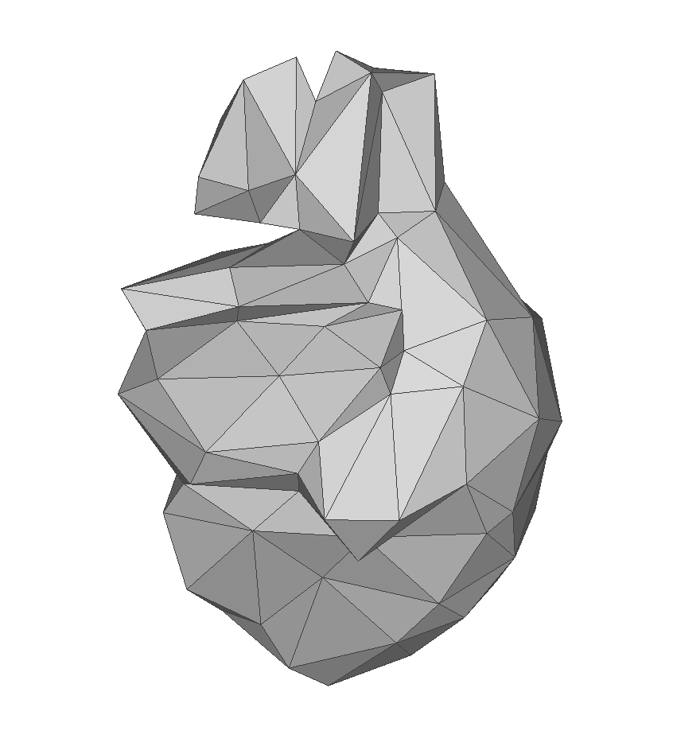
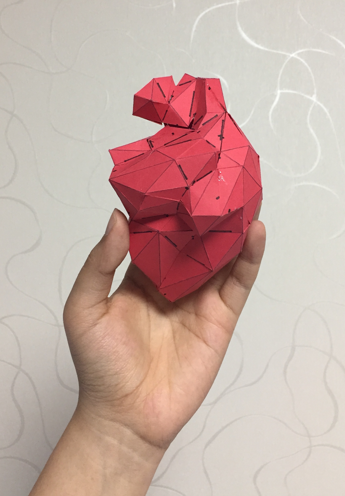

# Heart Pendant

 

## Folding Instructions

0. Download [the net](./Heart-215_cut.svg)
1. Print and then cut the net. We use [cricut](https://home.cricut.com/) in all of our examples.
2. Score the crease lines. 
3. Crease the lines into moutain and valley folds. 
   * The crease lines with yellow line segments are valley folds.
4. Glue or tape the cut edges (the boundary lines). 
   * Start from a vertex marked with a square and tape its incident cut edges. 
   * Continue to "zip" the adjacent cut edges util you encounter a cut edge that is marked with a short stroke. 
5. Continue the fabrication process by finding another vertex and repeat the instruction above.
6. To tape or glue the remaining cut edges by matching the cut edges marked with a short stroke. 
   * Two matching cut edges will have the short strokes coincide along the edge. 

## The net

