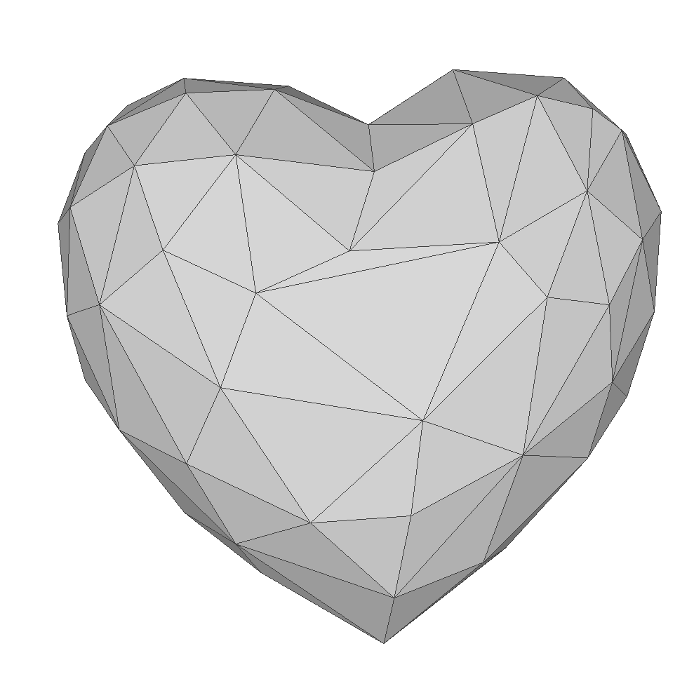

# Heart Pendant

 

## Folding Instructions

1. Print and then cut the outline. We use cricut in all of our examples.
2. Score the crease lines. 
3. Crease the lines into moutain and valley folds. The crease lines with black line segments are valley folds.
4. Glue or tape the cut lines. Start from a vertex marked with a square and tape its incident cut edges. Continue to "zip" the adjcent cut edges util a cut edge marked with a short stroke. 
5. Continue by finding another vertex and repeat the taping process.
6. Tape the remaining edges by matching the cut edges marked with a short stroke. Two matching cut edges will have the short strokes coincide along the edge. 

## the net

